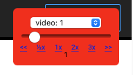

# Media Speed Bookmarklet
Simple bookmarklet to control html video and audio speed.

## Motivation

I've gotten used to watching the majority of youtube videos at 2x speed. Sometimes 2x isnt enough and I need more. Sometimes I write code.

### Features
* Ability to set the playback speed for every audio or video element on the page
* Ability to skip to the end of a piece of media. This skips ads too
* Ability to go back to the beginning
## Installation

1. Go to this page https://caiorss.github.io/bookmarklet-maker/
1. Give it a title
1. Copy the contents of index.js into the `Code` text area
1. Click the "Generate Bookmarklet" button
1. Drag that blue link to your bookmarks bar
### Usage

1. Go a webpage with audio or video, or both, elements
1. Click on the bookmarklet you just created
1. Choose the audio or video from the drop down that you want to speed up or slow down
1. Slide the slider to change the media's speed
1. Enjoy

## Development

I wrote this in longform js so that it is easy to understand and modify. Have fun submitting any improvements. Someone make it bounce in or something cool.

## License

MIT
